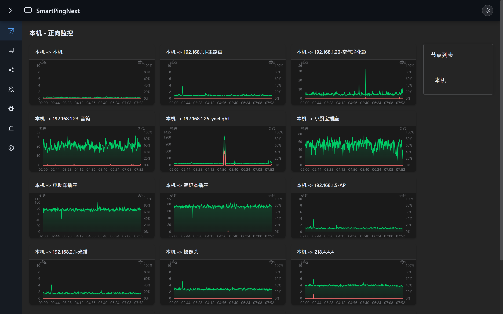

<p align="center">
    <h3 align="center">SmartPingNext | 开源、高效、便捷的网络质量监控神器</h3>
    <p align="center">
       一个综合性网络质量(PING)检测工具，支持正/反向PING绘图、互PING拓扑绘图与报警、全国PING延迟地图与在线检测工具等功能
        <br>
        <a href="./README_EN.md">English README</a>
        <br>
        <br>
        <a href="https://github.com/Antman2023/SmartPingNext/releases">
            
        </a>
        <a href="https://github.com/Antman2023/SmartPingNext/blob/master/LICENSE">
            
        </a>
    </p>
</p>

## 界面展示



## 功能

- 正向PING，反向Ping绘图
- 互PING间机器的状态拓扑，自定义延迟、丢包阈值报警（声音报警），报警时MTR检测
- 全国PING延迟地图（各省份可分电信、联通、移动三条线路）
- 检测工具，支持使用SmartPingNext各节点进行网络相关检测
- 节点编辑（支持修改节点名称和IP地址，自动同步关联配置）
- 配置导入/导出
- 支持深色/浅色主题切换
- 设置面板统一管理主题与语言
- 中英双语界面，支持运行时切换（无需刷新）
- 可收缩侧边栏
- 单文件部署，无需额外配置文件

## 技术栈

- **后端**: Go 1.24 + SQLite3（纯 Go 实现，无 CGO 依赖）
- **前端**: Vue 3 + TypeScript + Vite + Element Plus + ECharts

## 快速开始

### 下载发布版

从 [Releases](https://github.com/Antman2023/SmartPingNext/releases) 下载对应平台的版本：

| 平台 | 架构 | 文件 |
|------|------|------|
| Linux | amd64 | smartping-linux-amd64.tar.gz |
| Linux | arm64 | smartping-linux-arm64.tar.gz |
| Linux | armv7 | smartping-linux-armv7.tar.gz |
| Windows | amd64 | smartping-windows-amd64.zip |
| macOS | arm64 | smartping-darwin-arm64.tar.gz |

```bash
# Linux/macOS
tar -xzf smartping-*.tar.gz
./smartping

# Windows
# 解压 smartping-*.zip
# 双击运行 smartping.exe
```

首次运行会自动创建 `conf/`、`db/`、`logs/` 目录并释放默认配置文件。

### 从源码构建

```bash
# 前端
cd web
npm install
npm run build
cp -r dist ../src/static/html

# 后端
cd ..
go build -o smartping src/smartping.go
```

### Docker

支持多架构镜像：`linux/amd64`、`linux/arm64`、`linux/arm/v7`

```bash
docker pull pathletboy/smartping-next:latest

# 运行容器
docker run -d \
  --name smartping \
  -p 8899:8899 \
  -v smartping-conf:/app/conf \
  -v smartping-db:/app/db \
  -v smartping-logs:/app/logs \
  --restart unless-stopped \
  pathletboy/smartping-next:latest

# 或自行构建
docker build -t smartping-next:latest .
docker run -d --name smartping -p 8899:8899 smartping-next:latest

# 或使用 docker-compose
docker-compose up -d
```

**默认端口**: 8899 | **默认密码**: smartping

## 设计思路

本系统的定位为轻量级工具，即使组多点成互Ping网络可以遵守无中心化原则，所有的数据均存储自身节点中，每个节点提供出方向的数据，从任意节点查询数据均会通过Ajax请求关联节点的API接口获取并组装全部数据。

## 目录结构

```
├── src/                    # Go 后端源码
│   ├── smartping.go        # 程序入口
│   ├── g/                  # 全局配置和数据结构
│   ├── http/               # HTTP 服务层
│   ├── funcs/              # 核心业务逻辑
│   ├── nettools/           # 底层网络工具
│   └── static/             # 嵌入的静态文件
│       ├── html/           # 前端页面
│       ├── conf/           # 默认配置
│       └── db/             # 默认数据库
├── web/                    # Vue 3 前端源码
│   ├── src/
│   │   ├── views/          # 页面组件
│   │   ├── components/     # 通用组件
│   │   ├── api/            # API 接口
│   │   └── assets/         # 静态资源
│   └── package.json
├── conf/                   # 配置文件（运行时生成）
├── db/                     # SQLite 数据库（运行时生成）
└── logs/                   # 日志文件（运行时生成）
```

## API 端点

| 端点 | 方法 | 描述 |
|------|------|------|
| `/api/config.json` | GET | 获取配置 |
| `/api/ping.json` | GET | 获取 PING 数据 |
| `/api/topology.json` | GET | 获取拓扑状态 |
| `/api/alert.json` | GET | 获取报警日志 |
| `/api/mapping.json` | GET | 获取地图数据 |
| `/api/tools.json` | GET | 在线检测工具 |
| `/api/saveconfig.json` | POST | 保存配置 |
| `/api/proxy.json` | GET | 代理访问远程节点 |

## 项目贡献

欢迎参与项目贡献！比如提交PR修复一个bug，或者新建 [Issue](https://github.com/Antman2023/SmartPingNext/issues/) 讨论新特性或者变更。

## 致谢

本项目基于 [smartping/smartping](https://github.com/smartping/smartping) 开发，在原有功能基础上进行了以下改进：

- 使用 Vue 3 + TypeScript + Element Plus 重构前端
- 单文件部署，前端和默认配置嵌入二进制
- 纯 Go SQLite 驱动，无 CGO 依赖，跨平台编译
- 新增深色/浅色主题切换支持
- 可收缩侧边栏
- 中英双语界面，支持运行时切换
- 配置导入/导出功能
- Docker 镜像支持
- GitHub Actions 自动构建多平台发布包
- 图表组件防抖优化，减少频繁重绘
- 全局错误边界，提升用户体验
- 类型安全增强，移除不安全的类型断言
- 内存泄漏修复，确保组件正确销毁
- 改进响应式布局适配
