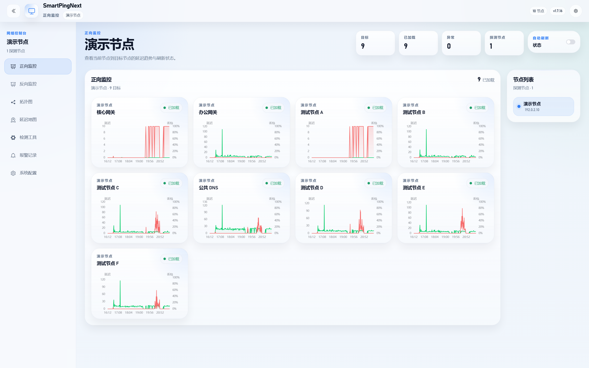

<p align="center">
    <h3 align="center">SmartPingNext | Open-source, Efficient, and Practical Network Quality Monitoring</h3>
    <p align="center">
       A comprehensive network quality (PING) monitoring tool with forward/reverse PING charts, mutual PING topology with alerts, nationwide latency map, and online diagnostic utilities.
        <br>
        <a href="./README.md">中文说明</a>
        <br>
        <br>
        <a href="https://github.com/Antman2023/SmartPingNext/releases">
            
        </a>
        <a href="https://github.com/Antman2023/SmartPingNext/blob/master/LICENSE">
            
        </a>
    </p>
</p>

## Screenshot



## Features

- Forward PING and reverse PING charting
- Mutual PING topology between nodes, customizable latency/loss alert thresholds (with sound), plus MTR checks on alert
- Nationwide latency map (Telecom / Unicom / Mobile lines per province)
- Built-in diagnostic tools using SmartPingNext nodes
- Node editing (modify name and IP address with automatic reference syncing)
- Configuration import/export
- Light/Dark theme switching
- Unified settings panel for theme and language
- Bilingual UI (Chinese/English) with runtime switching (no page reload)
- Collapsible sidebar
- Single-binary deployment with no extra setup files required

## Tech Stack

- **Backend**: Go 1.24 + SQLite3 (pure Go driver, no CGO dependency)
- **Frontend**: Vue 3 + TypeScript + Vite + Element Plus + ECharts

## Quick Start

### Download Release

Download the package for your platform from [Releases](https://github.com/Antman2023/SmartPingNext/releases):

| Platform | Arch | File |
|------|------|------|
| Linux | amd64 | smartping-linux-amd64.tar.gz |
| Linux | arm64 | smartping-linux-arm64.tar.gz |
| Linux | armv7 | smartping-linux-armv7.tar.gz |
| Windows | amd64 | smartping-windows-amd64.zip |
| macOS | arm64 | smartping-darwin-arm64.tar.gz |

```bash
# Linux/macOS
tar -xzf smartping-*.tar.gz
./smartping

# Windows
# unzip smartping-*.zip
# double-click smartping.exe
```

On first run, the app creates `conf/`, `db/`, and `logs/` automatically and extracts default config files.

File logs are routed to `info.log`, `debug.log`, and `error.log`. Each file rotates before a write would exceed 10 MiB, retaining up to 3 backups (`.1` is newest, `.3` oldest); older backups are deleted. Rotation accounts for existing file sizes after a restart. A single oversized entry is kept intact and may exceed the limit. The default log level is `info`; set `SMARTPING_LOG_LEVEL` to change it. Standard output remains enabled, with retention managed by the runtime, such as Docker.

### Build from Source

Requires Go 1.24+ and Node.js 20.19+ or 22.12+.

```bash
# Frontend
cd web
npm ci
npm run build:embed

# Backend
cd ..
go build -o smartping src/smartping.go
```

`build:embed` works on Windows, Linux, and macOS. After a successful frontend build, it replaces the generated files in `src/static/html`, avoiding nested copies and stale bundled assets. Use `npm run build` when you only need the frontend output.

### Local Development and Validation

After building the frontend as above, start the built executable: `./smartping` on Linux/macOS, or build with `go build -o smartping.exe ./src` and run `.\smartping.exe` on Windows. In another terminal, enter `web` and run `npm run dev`. Open the development URL printed in the terminal (port 3000 by default); API requests are proxied to `http://localhost:8899`.

Runtime configuration, databases, and logs are stored beside the executable. Use a build at a fixed location to retain development data instead of a temporary `go run` executable.

Override these settings in `web/.env.development.local` and restart the development server:

| Variable | Default | Purpose |
|----------|---------|---------|
| `VITE_PROXY_TARGET` | `http://localhost:8899` | Backend address for the development proxy |
| `VITE_API_BASE_URL` | `/api` | Browser API prefix, including configuration and password verification |
| `VITE_API_TIMEOUT` | `15000` | Ordinary API timeout in milliseconds; remote node proxy requests allow additional response time |
| `VITE_DEFAULT_TIME_RANGE` | `6` | Default hours in forward and reverse details, from 1 minute to 31 days; invalid values fall back to 6 hours |

When using the development proxy, keep the `/api` prefix and change only `VITE_PROXY_TARGET`. The proxy preserves the browser's `Host` and `Origin` headers for the backend's configuration request origin checks. `VITE_` variables are included in frontend code and must not contain passwords. Changes for production require rebuilding both the frontend and the Go executable.

```bash
# From web: tests and lint, including local proxy integration tests
npm test
npm run lint

# From the project root: backend tests and static analysis
go test ./src/...
go vet ./src/...
```

Configuration imports accept files up to 16 MiB. Imported changes must be saved before they apply to the node. Password verification failures or timeouts during import and export preserve current edits.

Hostname resolution for online tools, scheduled Ping, mapping probes, and alert MTR waits up to 5 seconds. Caller cancellation or an earlier deadline ends resolution sooner. IPv4 literals skip DNS.

On Windows, install Go and Zig on PATH, then run `pwsh -File scripts/test-race-windows.ps1` from the project root for Go race detection. The helper uses `zig cc`, adds the Windows synchronization library and a fixed loading mode for race test executables, and restores environment variables on exit. Release builds still do not require CGO. This workflow was verified with Go 1.27.1, Zig 0.16.0, and Windows amd64.

### Docker

Multi-arch images are supported: `linux/amd64`, `linux/arm64`, `linux/arm/v7`

```bash
docker pull pathletboy/smartping-next:latest

# run container
docker run -d \
  --name smartping \
  -p 8899:8899 \
  -v smartping-conf:/app/conf \
  -v smartping-db:/app/db \
  -v smartping-logs:/app/logs \
  --restart unless-stopped \
  pathletboy/smartping-next:latest

# or build by yourself
docker build -t smartping-next:latest .
docker run -d --name smartping -p 8899:8899 smartping-next:latest

# or use docker-compose
docker-compose up -d
```

**Default Port**: 8899 | **Default Password**: smartping

## Design Notes

SmartPingNext is designed as a lightweight tool. Even in multi-node mutual-PING setups, it follows a decentralized approach:
- Each node stores its own data
- Each node exposes outbound monitoring data
- Querying from any node aggregates data from related nodes via AJAX API calls

## Project Structure

```text
├── src/                    # Go backend source
│   ├── smartping.go        # entry
│   ├── g/                  # global config and structs
│   ├── http/               # HTTP service layer
│   ├── funcs/              # core business logic
│   ├── nettools/           # low-level network tools
│   └── static/             # embedded static assets
│       ├── html/           # frontend bundle
│       ├── conf/           # default config
│       └── db/             # default database
├── web/                    # Vue 3 frontend source
│   ├── src/
│   │   ├── views/          # page components
│   │   ├── components/     # shared components
│   │   ├── api/            # API clients
│   │   └── assets/         # static assets
│   └── package.json
├── conf/                   # runtime config (generated at runtime)
├── db/                     # SQLite database (generated at runtime)
└── logs/                   # logs (generated at runtime)
```

## API Endpoints

| Endpoint | Method | Description |
|------|------|------|
| `/api/config.json` | GET | Get configuration |
| `/api/ping.json` | GET | Get PING data |
| `/api/topology.json` | GET | Get topology status |
| `/api/alert.json` | GET | Get alert logs |
| `/api/mapping.json` | GET | Get map latency data |
| `/api/tools.json` | GET | Online diagnostics |
| `/api/saveconfig.json` | POST | Save configuration |
| `/api/proxy.json` | GET | Proxy access to remote nodes |

The metric arrays returned by `/api/ping.json` align with the `lastcheck` timeline and contain string values. Minutes without a stored sample use `"-"` and appear as gaps in charts. `"0"` is a recorded zero value, distinct from missing data. API clients should handle `"-"` before converting values to numbers. Query times and the returned timeline use the node's timezone.

`/api/topology.json` returns string states by target IP: `"true"` means the alert threshold has not been reached, `"false"` means it has, and `"unknown"` means no samples exist for that target in the configured check window (including the grace period for rounds finishing across a minute boundary). Unknown states neither trigger alerts nor mark existing alerts as recovered. Clients must handle all three values explicitly instead of treating every non-`"false"` value as healthy.

## Contributing

Contributions are welcome. Feel free to open a PR for bug fixes, or create an [Issue](https://github.com/Antman2023/SmartPingNext/issues/) for feature discussions.

## Acknowledgements

This project is based on [smartping/smartping](https://github.com/smartping/smartping), with major enhancements including:

- Frontend rebuilt with Vue 3 + TypeScript + Element Plus
- Single-binary deployment with embedded frontend and default config
- Pure Go SQLite driver without CGO, enabling easier cross-platform builds
- Light/Dark theme support
- Collapsible sidebar
- Bilingual UI with runtime language switching
- Configuration import/export
- Docker image support
- GitHub Actions for multi-platform packaging
- Chart component debounce optimization for reduced redraws
- Global error boundary for improved user experience
- Enhanced type safety with removal of unsafe type assertions
- Memory leak fixes ensuring proper component cleanup
- Better responsive layout behavior
- Global ICMP connection pool to eliminate false packet loss under concurrent pings
- Fix deleted nodes still appearing on chart pages
- Fix ICMP DestinationUnreachable type assertion error
- Fix 24-hour upper limit on ping data queries
- Fix minimum delay falsely reported as 0 due to timing race
